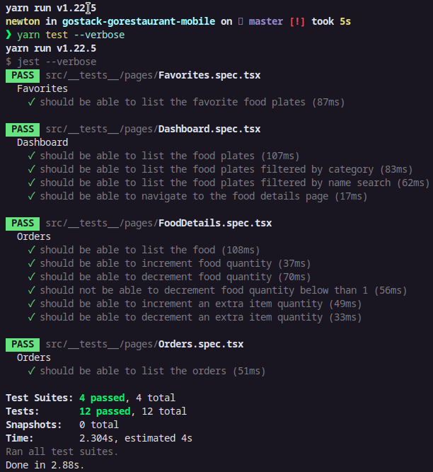
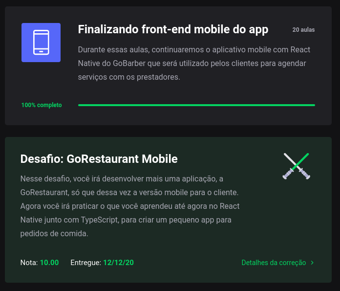

<h3 align="center">Bootcamp GoStack 13 - Desafio: GoRestaurant Mobile</h3>

Nesse desafio, devemos criar um pequeno app de pedidos de comida, o GoRestaurant, só que dessa vez a versão mobile, para praticar o que aprendemos até agora no React Native junto ao TypeScript.

Esse app deve se conectar a uma fake API, e exibir e filtrar os pratos de comidas e permitir a criação de novos pedidos.

#### Para esse desafio temos os seguintes testes:

- should be able to list the food plates
- should be able to list the food plates filtered by category
- should be able to list the food plates filtered by name search
- should be able to navigate to the food details page
- should be able to list the favorite food plates
- should be able to list the orders
- should be able to list the food
- should be able to increment food quantity
- should be able to decrement food quantity
- should not be able to decrement food quantity below than 1
- should be able to increment an extra item quantity
- should be able to decrement an extra item quantity

## Clonar e Testar

`$ git clone https://github.com/Newton-Duarte/gostack-gorestaurant-mobile.git`

`$ cd gostack-gorestaurant-mobile`

`$ yarn` ou `$ npm install`

`$ yarn test` ou `$ npm run test`

